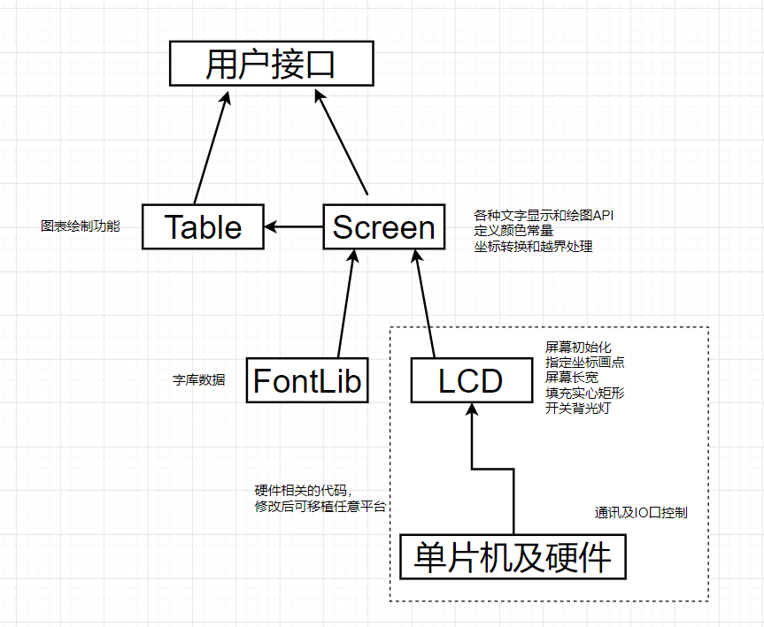

# C语言单片机屏幕驱动代码及图表绘制功能
本代码不仅限于此单片机和屏幕，更换单片机或屏幕仅需修改LCD.c和LCD.h文件即可移植所有功能

## 演示DEMO

```C++
#include <ti/devices/msp432p4xx/driverlib/driverlib.h>

#include <stdbool.h>
#include <stdint.h>
#include "delay.h"
#include "sysinit.h"
#include "Screen.h"
#include "Table.h"

TableStruct table1, table2, table3, table4;

const float Sin[100]={//此处添加正弦曲线的y轴点集
};
const float randData[1000]={//此处添加随机曲线的y轴点集
};


int main(void) {
    SysInit();
    delay_init();
    //下两行用于硬件加速浮点运算，不需要可以删除
    MAP_FPU_enableModule();
    MAP_FPU_enableLazyStacking();

    ScreenInit(BLUE);
    ScreenSetDirection(3);
    table1 = defaultTable(75,0,0,100,150,-150);
    table1.xStep = 2;
    table2=table1;
    table2.left=160;
    table3 = defaultTable(50,0,120,100,7,-56);
    table3.xStep = 3;
    table4=table3;
    table4.left=160;
    TableInit(&table1);
    TableInit(&table2);
    TableInit(&table3);
    TableInit(&table4);
    int i=0;
    int j=0;
    while(1)
    {
        if(i%10==1)
        {
            TableDraw(&table3,randData+j,50);
            TableAutoDraw(&table4,randData+j,50,1);
            j=(j+50)%950;
        }
        TableUpdate(&table1,Sin[i]+0.5*Sin[(2*(i)+5)%100]);
        TableAutoUpdate(&table2,Sin[i]+0.5*Sin[(2*(i)+5)%100],10);
        i=(i+1)%100;
        delay_ms(100);
    }
}
```
注：代码使用内联函数来减少多层抽象带来的开销，所以编译器需设置为C99及以上标准。为提高性能，建议将编译优化开到最大
## 配套的硬件资源
### 1. 单片机   
MSP-EXP432P401R  

### 2. TFT液晶屏
尺寸：2.8寸  
分辨率：240*320像素  
通讯方式：4线SPI通讯（本代码仅使用了3线，MOSI引脚未使用）  
色彩：65K RGB565  
驱动芯片： ILI9341  

## 接线方式
LED（或BK，即背光控制）接P4.2  
SCK接P1.5  
MOSI（或SDI）接P1.6  
DC（或RS，命令和数据区分标志）接P4.1
RST（即复位控制）接P4.3  
CS接P4.0  

## 设计方案

1. 用户代码调用Screen和Table的接口
2. 移植任意平台或更换屏幕仅需更改LCD.h和LCD.c的代码
接口详情见头文件的注释
